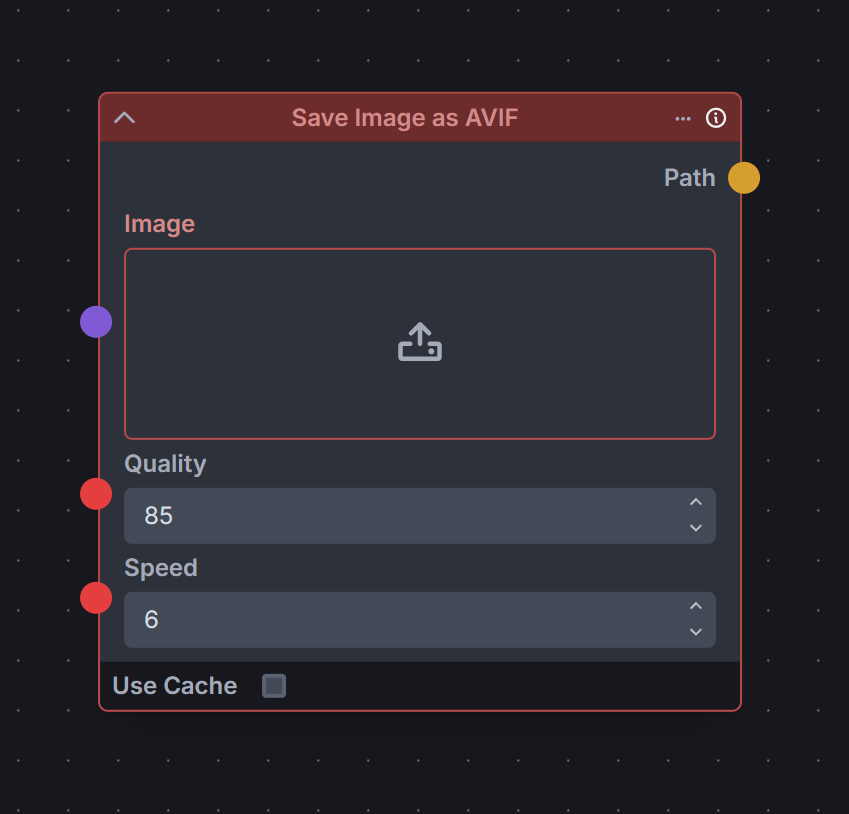
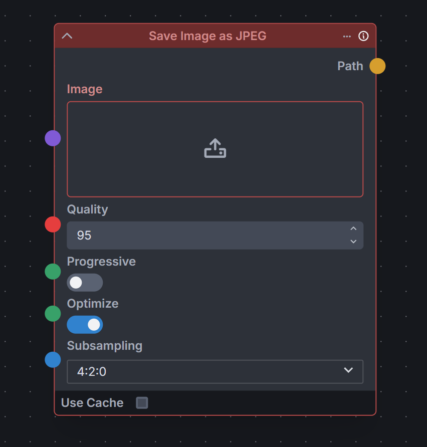
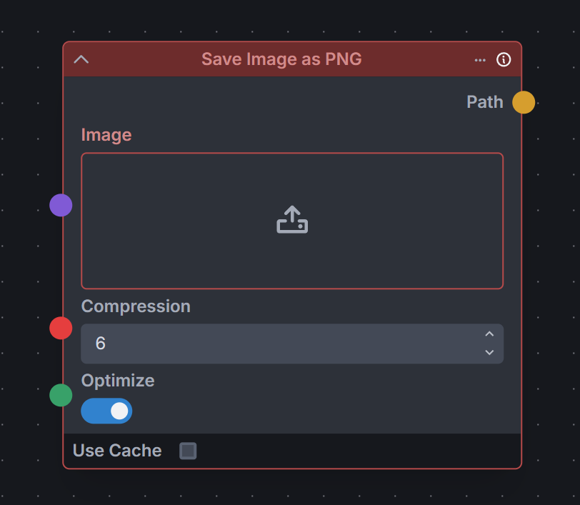
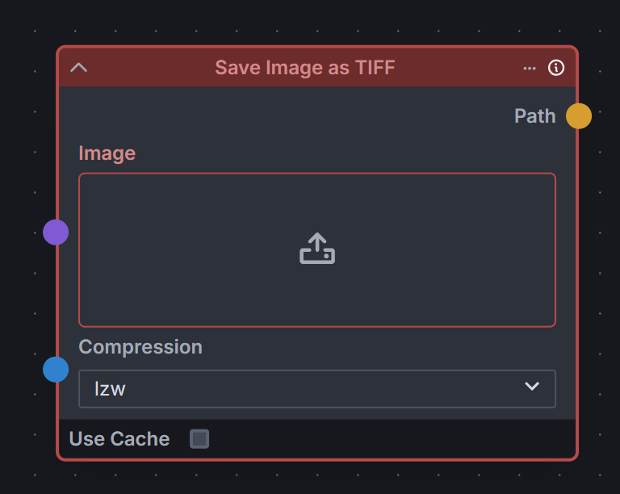
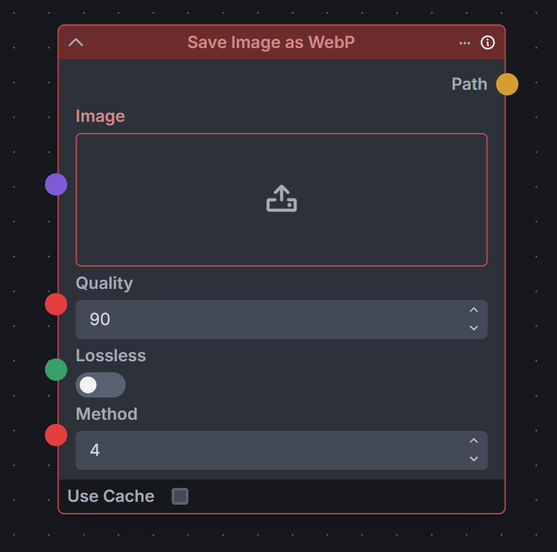

# Invoke Image Export

Custom nodes for [InvokeAI](https://github.com/invoke-ai/InvokeAI) that export images in various formats (AVIF, JPEG, PNG, TIFF, WebP) with format-specific compression and quality options.

---

<section>
  
  
  
  
  
</section>


## Installation

1. Copy or clone this repository into the `nodes` folder found in your Invoke install location
2. **(Optional, for AVIF support)** Install AVIF plugin through the launcher console:

```venv
uv pip install pillow-avif-plugin
```

3. Restart Invoke and the nodes will appear in the image category as `Save Image as PNG`, `Save Image as JPEG`, etc.

## Notes

Exported images are saved to `outputs/invoke_image_export/` with format-prefixed filenames. Images with transparency are automatically converted to RGB when saving as JPEG.
